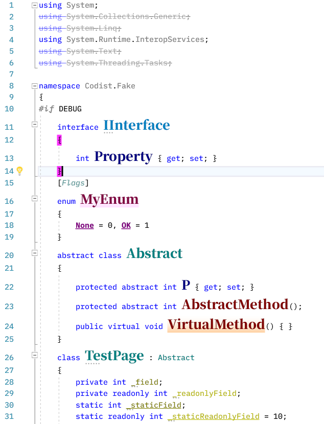
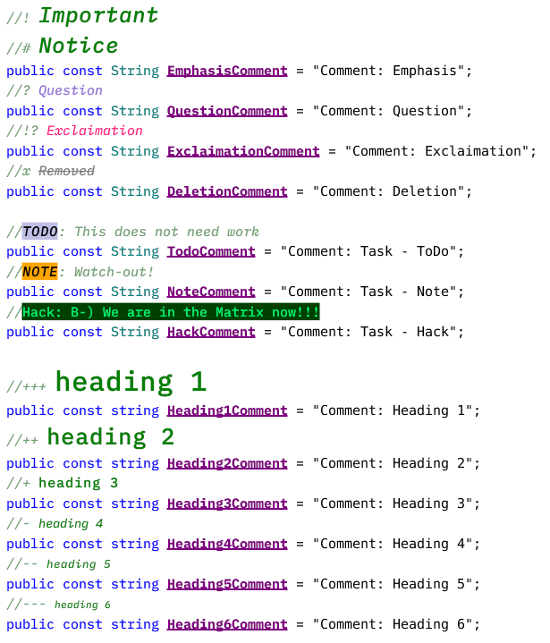
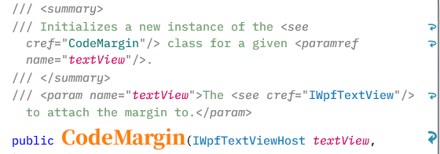
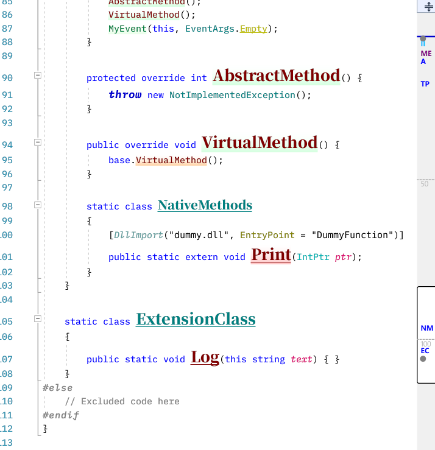
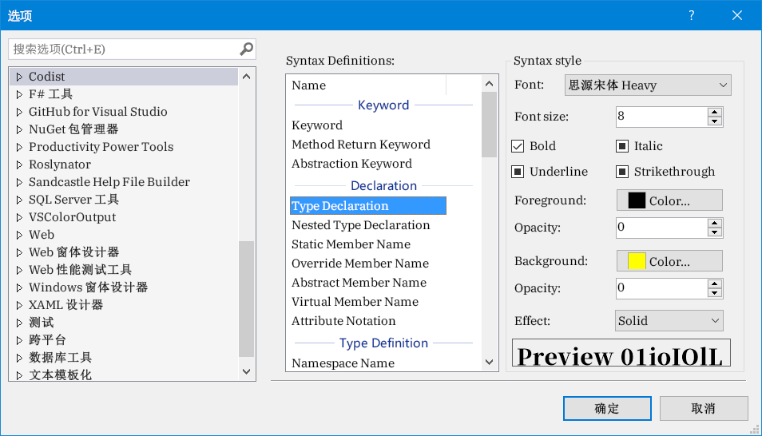
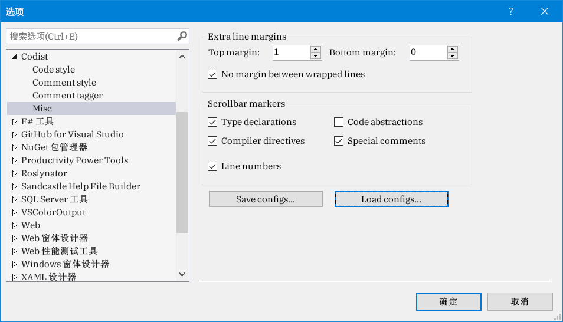

# Codist
*Codist* is a visual studio extension which strives to provide better coding experience for C# programmers.
* advanced syntax highlighting
* C# comment tagger
* scrollbar marker for
  * special comment tags
  * C# type declarations
  * C# directives
  * line numbers
* increased margin between lines

# Features and screenshots

## Advanced C# syntax highlight
* The advanced syntax highlight function highlight every aspect of C# language elements with various styles and font settings, changing font style sizes, changing background and foreground colors, making text semitransparent.
  

## Customized comment styles
* The comment tagger highlights comments (actually all editor styles) to your specific styles.
  
* The syntax style of C# XML Documentations could be changed too. You can make them semitrasparent to stand behind usual code lines.
  

## Markers on the Scrollbar Margin

The scrollbar can mark...

* C# `class`/`struct`/`interface`/`enum` **declarations**
* C# instructions (`#if`, `#else`, `#region`, `#pragma`)
* **Line numbers**
  

# Customization
1. Open the *Codist* section in the *Tools->Options* dialog.
1. By default, *Codist* does not make many changes to your syntax.
1. Change the settings according to your preferences and click the OK button.
  
1. It is also possible to increase line heights to make code text more readable.
  

# Acknowledgements
I have learned a lot from the following extension projects.
* Better comments: https://marketplace.visualstudio.com/items?itemName=OmarRwemi.BetterComments
* CommentsPlus: https://marketplace.visualstudio.com/items?itemName=mhoumann.CommentsPlus
* Match Margin: https://marketplace.visualstudio.com/items?itemName=VisualStudioProductTeam.MatchMargin
* Inheritance Margin: https://marketplace.visualstudio.com/items?itemName=SamHarwell.InheritanceMargin
* Font Sizer: https://marketplace.visualstudio.com/items?itemName=KarlShifflettkdawg.FontSizer
* CodeBlockEndTag: https://marketplace.visualstudio.com/items?itemName=KhaosPrinz.CodeBlockEndTag
* Remarker: https://marketplace.visualstudio.com/items?itemName=GilYoder.Remarker-18580
* CoCo: https://marketplace.visualstudio.com/items?itemName=GeorgeAleksandria.CoCo-19226