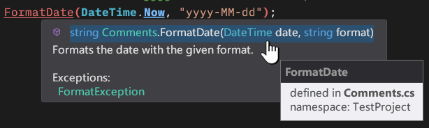
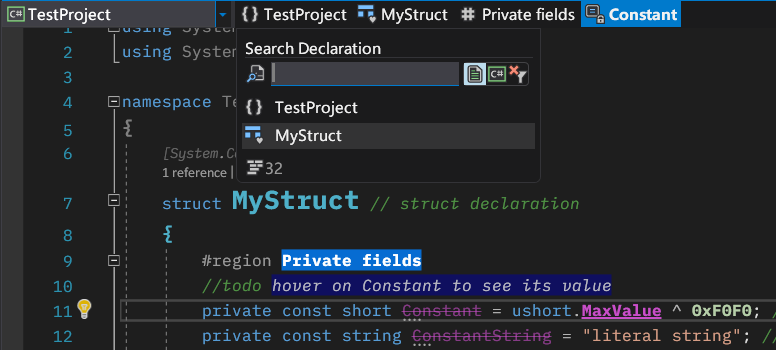
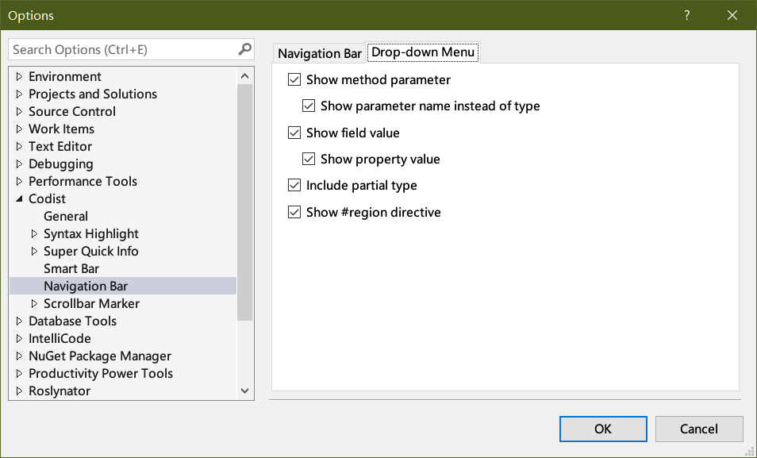

# Codist
*Codist* is a Visual Studio extension which strives to provide better coding experience and productivity for C# programmers.

# Features

* [Advanced syntax highlight](#advanced-c-syntax-highlight) with [*comment tagger*](#comment-tagger-and-styles)
* [Super Quick Info](#super-quick-info) with *Click and Go* to source code
* [Smart Bar](#smart-bar) with symbol reference analyzers
* [Scrollbar Marker](#scrollbar-marker)
* [Symbol Marker](#symbol-marker)
* [Navigation bar](#navigation-bar) (**new in version 4.0**)
* [Display enhancements](#display-enhancements)
* [Comprehensive configurations](#feature-control)
* [License](#license), [Bugs and sugguestions](#bugs-and-suggestions)

## Advanced C# Syntax Highlight

  The advanced syntax highlight function highlights every aspect of C# language elements with various styles and font settings, changing font style sizes, changing background and foreground colors, making text semitransparent.

  The following screenshots of the `TestPage.cs` file in the source code project demonstrates possible syntax highlight effects in the Light theme.
 
   

  * The font size of type and member declarations can be enlarged, so it is much easier to spot them.
  * Syntax highlight can be applied to braces and parentheses.
  * Various syntax identifiers have different styles.
  * Comment content can be tagged (e.g. _note_).
  * Unnecessary code is marked strike-through.
  * Keywords are categorized and highlighted with various styles (e.g. `abstract` and `sealed`, `return` and `throw`, etc.).
  * Overriding methods (such as `ToString`) can be painted with gradient background color.
  * Imported symbols (from external assemblies, e.g. `NotImplementedException`, `ToString`) can be marked with a different style (bold here) from symbols in your code, which are also possible to be styled.
  * All the above styles are customizable.

### Default Syntax Highlight Themes

  To quickly get started with advanced syntax highlight, navigate to the *Syntax Highlight* section, click the **Light theme** or **Dark theme** button in the *options* dialog and see them in effect. Don't forget to click the *OK* button to confirm the change.

  

  With the **Save** and **Load** buttons, you can backup and share your own syntax highlight settings.

  If you mess up your syntax highlight styles, you can press the _Reset_ button to reset all settings to default, or press the _Light theme_ or _Dark theme_ button to reapply predefined themes.

  **Note**: There is a known issue in _Codist_ that if you change the theme of Visual Studio, you may have to restart it for the syntax highlight to work properly.

  From version 4.5 on, it is possible to load only part of the syntax preset or backup theme by unchecking check boxes under _Load following parts when importing themes_.

### Customization of Syntax Highlight Styles

  To customize and tweak the syntax highlight styles, click the sub sections inside the *Syntax Highlight* section to change individual styles, accordingly.

  

  Syntax definitions under the _All languages_ section apply to all languages; those under _Comment_ section apply to comment taggers (see below), others apply to corresponding languages accordingly.

  **TIP**: Open a document window before you change the syntax theme or tweak the syntax highlight settings. While you change theme, you can see how the styles change in the code document window simultaneously.

### My Symbols and External Symbols

  _Codist_ can also identify symbols which are defined in your source code and which are imported from external assemblies. This feature is so unique that you may not find it elsewhere.

  You can customize it in the *Symbol Marker* tab of in the *C#* section of *Syntax Highlight*. Style _My Type and Member_ is used for symbols from your code, and _Referenced Type and Member_ is used for symbols imported from external assemblies.

  

  **Note**: the predefined _Light theme_ and _Dark theme_ have defined external symbols with bold style, as the above screenshot shows.

## Comment Tagger and Styles
* The comment tagger highlights comments to your specific styles, according to the first token inside the comment.

  Here are default effects of the some tagged comments.

  

  To configure the comment tags, click the *Tags* tab, in the *Comment* sub-section of the *Syntax Highlight* section, where you can add, remove or modify comment tags.

  

  To disable comment tagger, uncheck the check box of _Comment Tagger_ on the _Syntax Highlight_ option page.

* The syntax style of comments or C# XML Documentations could be changed too. You can make them semitrasparent to stand behind usual code lines by changing the *Opacity* or the *Font size* value of the corresponding syntax parts.

  

  **Note**: the predefined _Light theme_ and _Dark theme_ have defined XML Doc with a smaller font size (-1), as the above screenshot shows.

## Super Quick Info

The quick info (the tooltip shown when you hover your mouse pointer on your C# source code) can be enhanced by *Codist*.

### General Quick Info

To customize the *Super Quick Info*, adjust the settings in the options page.

  

Options in the _General_ page apply to all code editor windows.

* **Hide Quick Info until Shift key is pressed**

  By default, _Quick Info_ appears when you hover your mouse over a symbol or syntax token in code editor. Some programmers think this behavior interferes their workflow. Checking this option will suppress the _Quick Info_ until Shift key is pressed.

* **Show info about selection length**

  This option will show how many characters and lines in your selection (if your selection spans over multiple lines). So you don't have to count characters one by one.

  

* **Show info about color**

  This option enables you preview color values. It works for hex color values (such as `#00FF00`£¬`#FF993300`), named colors (such as `Black`, `White`, etc.).

  

  In C# code editor, it analysis system colors (such as `SystemColors.WindowColor`, `SystemColors.Control`, etc.), `Color.FromArgb` or `Color.FromRgb` expression with constant values as well.

  

  The color info not only works in code windows, but also in debugger _Watch_ window.

  

### C# Quick Info

  _Super Quick Info_ especially enhances programming experience for C# programmers. There are plenty of options available in the options page.

  

* **Click and go** to source code of symbol definition

  If a symbol is defined in your source code, you can click and go to its definition on the Quick Info window. There's no need to hit `F12` on your keyboard any more. Even more, _Codist_ also tells you where the symbol is defined if you hover your mouse over it.

  

* **Override XML Documentation**

  The overridden XML Documentation makes the following changes to the documentation.

  * More syntax colors (adopting syntax highlight colors) for symbols.
  * Icons for documetation parts.
  * Selectable content of the documentation.
  * Symbols inside the documentation work with _Click and Go_ feature too.
  * Concise form of members (without leading namespace or containing type names, hover your mouse over a symbol to view its full definition).
  * Extra tags, such as `<b>` (for bold), `<i>` (for italic) and `<u>` (for underline) are supported.
  * Extra information from documentations (see below).

  

  When _Override XML Documentation_ checkbox is checked in the options page, it is also possible to activate options under it.

  * **Inherit from base type or interfaces** option will show documentation description from base `class`es or implemeted `interface`s if the XML Doc description of the current symbol is absent.

    

  * **Inherit from `<inheritdoc cref="MemberName"/>` target** option will borrow description from the referenced `MemberName`.

    

  * **Show `<returns>` XML Doc** and **Show `<remarks>` XML Doc** will add content of those tags.

  * **Override `<exception>` XML Doc** option adds back documentations for exceptions to the Quick Info.

    

* **Quick Info Item Size** 

    Quite often the Quick Info can take up a lot of space, covering almost half of the screen. It is possible to limit its size with *Super Quick Info* by assigning values to _Max width_ and _Max height_ in the options page.

  

### Additional Quick Info Items

   A dozen of additional quick info items could be displayed in the _Additional Quick Info Items_ options page.

   

* **Attributes** option shows attributes of a symbol.
* **Base types and interfaces** options shows inheritance and implementation info of a type. It is recommended to check **All ancestor types** and **Inherited interfaces** to display the complete info of the hierarchy of a type.

  

  Note: the `IDisposable` interface has special importance in .NET programming, thus it is assigned a special icon and pinned to the top of the interface list.

* **Declaration modifier** option shows modifiers to a symbol when it is not a public instance one.

  

* **Interface implementation** option shows if a member implements any interface.

  

* **Method overload** options shows possible overloads of a method (including applicable extension methods).

  

  This option also helps you find out correct overloads when any argument passed to a method is incorrect.

  

* **Parameter of method** options shows whether a token or an expression is the parameter of a method in the argument list. What is more, the documentation of the parameter is also displayed.

  

* **Type parameter** option shows information and documentation about type parameters.

* **Symbol location** shows where a symbol is defined.

* **Numeric forms** shows decimal, hexadecimal and binary forms for constant integer and `Enum` values.

  

  The binary form is useful when working with bit flags.

  

* **String length and Hash codes** for string constants.
  (Hint: We can use Hash codes to quickly compare whether two strings that look alike are identical)

## Smart Bar

The *Smart Bar* is a context-aware tool bar that appears automatically when you select some text, or double tap the _Shift_ key on your keyboard.

There are two toolbars on _Smart Bar_. The top bar contains general editing commands for all file types. Buttons on the bottom bar changes according to file types.

Buttons on the *Smart Bar* changes according to your selection, typical buttons are editing operations (e.g. _Cut_, _Copy_, _Paste_,  _Delete_, _Duplicate_, _Formatting_, _Find_, etc.), code analysis operations (e.g. _Go to defintion_, _Find references_), refactoring operations (e.g. _Rename_, _Extract method_, etc.)

  

Buttons on _Smart Bar_ usually have multiple functions, that is, left clicking it and right clicking it will trigger trigger different commands. For details, see the tooltip for the buttons. Right clicking a button usually expands the effective range of the command to the whole line, or brings a menu bar for more commands.

  

### C# Specific Commands

When you select a symbol, you may probably see a _Smart Bar_ like below.

  

The C# commands are on the second row.

The first one is **Go to Definition**, that behaves the same as the keyboard `F12` command. With this, you no longer need hitting the `F12` key to go to definition.

The second one is the **Analyze symbol...** button, a menu will pop up showing possible symbol analysis commands for the symbol. Since some commands require considerable amount of calculation, items ending with "..." will require a mouse click to expand. For instance, clicking the **Find Callers** command in the following screen shot will search the source code and list at what places are calling the selected method in a sub-menu. After the sub-menu is popped up, you can click items on the sub-menu and jump to the corresponding location.

  

### Symbol Marker

  _Symbol marker_ draws markers for C# symbols.

  Typically, you can double click a symbol in the C# source code, select the *Mark Symbol* command on the *Smart Bar* and choose the desired highlight marker on the drop-down menu.

  

  After applying the command, all occurrences of the marked symbol will be marked with a different style.

  

  To remove symbol marker, click the *Remove symbol mark* command in the drop-down menu of the *Mark symbol* command.

  Symbol markers will be cleared when the solution is unloaded.

  **Note**: The style of symbol markers can be customized in options page of the *Syntax highlight* feature. The default colors are listed below. You also need to turn on the _Syntax Highlight_ feature in order to make this feature work.

  

### Behavior of Smart Bar

By default, _Smart Bar_ appears after selection change, you can change the behavior in the options page by unchecking the _Show Smart Bar when selection is changed_ checkbox.

  

_Smart Bar_ automatically disappear when you move your mouse cursor away from it, or execute a certain commands on the _Smart Bar_, or click somewhere else in the code editor window, emptying the selection.

To make _Smart Bar_ reappear, you can tap the `Shift` key on your keyboard twice within a second. This behavior can also be suppressed by unchecking the **Show/hide Smart Bar with Shift key** checkbox.

### Smart Bar in Other Windows

_Smart Bar_ also works on _Output_, _C# Interactive_, _Immediate (Debug)_, _Find Results_ and some other text selectable window panes. If you select a path within those windows, extra commands will pop up allowing you to open it directly or locate it in _Windows Explorer_.

  

From version 4.4 on, some extra buttons will show up on _Smart Bar_ in C/C++ code windows.

## Scrollbar Marker

_Scollbar Marker_ draws extra glyphs and shapes on the vertical scrollbar for the following syntax elements:

* C# `class`/`struct`/`interface`/`enum` **declarations** (marked with a square and their names)
* C# symbol match marker (matches symbol under the caret, marked with an aqua square)
* C# instructions (`#if`, `#else`, `#region`, `#pragma`) (marked with a gray spot)
* **Line numbers** (marked with gray dashed lines and numbers)
* Special comments tagged by comment tagger (marked with small squares)

  Please see the first screenshot of this article.

## Navigation Bar

  _Navigation bar_ locates at the top of the code editor window. It overrides the original navigation bar. When the _Navigation Bar_ is loadeded, it hides two drop-down lists on the original Navigation Bar, but preserves the project drop-down list.

  Basically, the _Navigation Bar_ serves the same purpose of the original one, displaying symbol information where the caret is placed.

  

  **Note**: currently Navigation Bar only work with C# code documents.

  Typically you can see three or four items on the bar.

  1. **Namespace node**: the innermost namespace which contains the caret. On the above screen shot, it is the "`TestProject`" node.
  2. **Type node**: the type which contains the caret. On the above screen shot, it is the "`MyStruct`" node.
  3. **Region node**: when the caret is between `#region` and `#endregion`, this node appears. On the above screen shot, it is the "`Private fields`" node.
  4. **Member node**: the member where the caret is in. This node is drawn highlighted. On the above screen shot, it is the "`Constant`" node.

  Nodes on the _Navigation Bar_ are clickable.

  1. Clicking on a **Namespace node** will popup a menu, displaying namespaces and types defined in the active document. You can click on those items and jump to the beginning of corresponding definitions.

     

     On top of the menu there is a **Search Declaration** box, within which you can type and search declarations.

     Besides the _Search Declaration_ box, there are three buttons. The first one is pressed by default, which restricts the search scope to active document. If the second one is pressed, it pops up the first button and expands the search scope to current project (see screen shot below). The third button clears the search box and reverts the items back to unfiltered namespaces and types.

     

  2. Clicking on a **Type node** will popup a menu, displaying members and regions defined within the type. You can click on those items and jump to the definition of the corresponding member.

     

     The current symbol where the caret is on is highlighted.

     Field values and auto-property expressions are also displayed on this menu. So, you can instantly know the initial value of fields.

     There is also a search box in this menu, which filters content of the menu. There are six buttons beside the search box. The first five of them narrow down the displayed items of the menu and the last one clears the filter.

     To navigate to the beginning of the type, click the first item on the menu.

   3. Clicking on a **Member node** will select the whole member. If you have the _Smart Bar_ feature on and let it appear when selection is changed, _Smart Bar_ will be displayed and let you perform actions onto the member.

      

### Customization

  The _Navigation Bar_ can be configure via the options page.

  

  * If **Show syntax detail** option is set, the _Navigation Bar_ not only shows available types and declarations in the code window like the original navigation bar, but also syntax nodes such as statements and expressions containing the caret.

    

  * If **Show symbol info tip** option is set, you can read information about a symbol when you hover your mouse onto a node.

    

  * If **Highlight node range in editor** option is set, when you hover the mouse over the node on the bar, corresponding span of the node will be highlighted in the editor.

    

   * If **Show #region name** option is set, `#region` names will be displayed on the Navigation Bar. If you pad region names with some non-alphabetic characters like "`#region [====== private methods ======]`", you can check the **Trim non-letter characters** checkbox so only alphabetic part like "`private methods`" will be displayed on the _Navigation Bar_.

  To customize drop-down menus of the _Navigation Bar,_ change options in the _Drop-down Menu_ tab.

  

## Display Enhancements

In the *Display* tab of the *General* options page, several display enhancement options are offered.

  

Within the *Extra line margins* group box, you can adjust margins between lines to make code lines more readable.

Programmers who do not like *ClearType* rendering, which made text blurry and colorful, may want to try _Force Grayscale Text Rendering_ options.

# Feature Control
  Open the *Codist* section in the *Tools->Options* dialog. In the *General* section you can toggle features of *Codist*.

  

1. *Feature controllers* contains check boxes which can be used to enable/disable features of *Codist*.

   When you are running on a laptop with battery. Disabling *Codist* may help it sustain a little bit longer.

   Someone who does not like the syntax highlight or use another syntax highlighter can also turn off the *Syntax Highlight* feature individually here.

   These **options will take effect on new document windows**. Existing document windows won't be affected.

2. To share or backup your settings of Codist, you can use the *Save* and *Load* buttons.

# Acknowledgements
I have learned a lot from the following extension projects.
* Visual Studio Productivity Power Tools: https://github.com/Microsoft/VS-PPT
* CoCo: https://github.com/GeorgeAlexandria/CoCo
* Better comments: https://github.com/omsharp/BetterComments
* CommentsPlus: https://github.com/mhoumann/CommentsPlus
* Inheritance Margin: https://github.com/tunnelvisionlabs/InheritanceMargin
* Font Sizer: https://github.com/Oceanware/FontSizer
* CodeBlockEndTag: https://github.com/KhaosCoders/VSCodeBlockEndTag
* Remarker: https://github.com/jgyo/remarker
* UntabifyReplacement: https://github.com/cpmcgrath/UntabifyReplacement
* Extensiblity Tools: https://github.com/madskristensen/ExtensibilityTools
* CodeMaid: https://github.com/codecadwallader/codemaid
* Select Next Occurence: https://github.com/2mas/SelectNextOccurrence

# License

_Codist_ comes from the open source community and it goes back to the community.

_Codist_ is **free** software: you can redistribute it and/or modify it under the terms of the GNU General Public License as published by the Free Software Foundation, either version 3 of the License, or (at your option) any later version.

This program is distributed in the hope that it will be useful, but WITHOUT ANY WARRANTY; without even the implied warranty of MERCHANTABILITY or FITNESS FOR A PARTICULAR PURPOSE. See the GNU General Public License for more details.

You should have received a copy of the GNU General Public License along with this program. If not, see "https://www.gnu.org/licenses".

# Bugs and Suggestions
Please [post New Issue](https://github.com/wmjordan/Codist/issues) in the [GitHub project](https://github.com/wmjordan/Codist) if you find any bug or have any suggestion.

Your vote and feedback on the [Visual Studio Extension Marketplace](https://marketplace.visualstudio.com/items?itemName=wmj.Codist) are also welcomed.

# Support Codist by Donation

If you like _Codist_ and want to support the future development of it, you can [donate to the author](https://paypal.me/wmzuo/19.99).

You can donate any amount of money as you like. The recommended amount of donation is `$19.99`.
