# Codist
*Codist* is a visual studio extension which strives to provide better coding experience for C# programmers. It features:
* Advanced syntax highlighting
* Super Quick Info
* C# comment tagger
* Scrollbar markers
* Increased margin between lines
* 
  

# Features and screenshots

## Advanced C# syntax highlight
* The advanced syntax highlight function highlight every aspect of C# language elements with various styles and font settings, changing font style sizes, changing background and foreground colors, making text semitransparent.

  **NOTE**: To quickly get started with advanced syntax highlight, click the *Load...* button in the *options* dialog, select *Light theme* or *Dark theme* from the pop-up menu to see them in effect. Don't forget to click the *OK* button to confirm the change.

  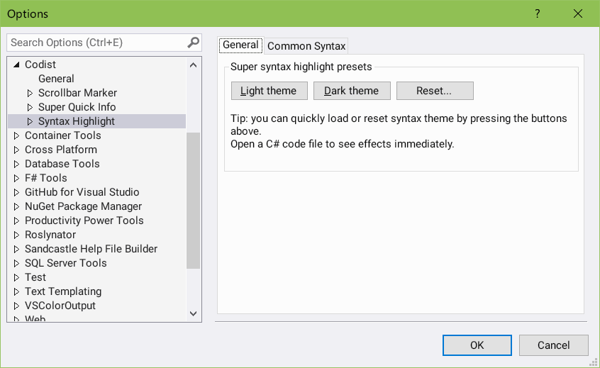

  The following screenshots of the `TestPage.cs` file in the source code project demonstrates possible syntax highlight effects.

  * The font size of type and member declarations can be enlarged, so it is much easier to spot them.
  * Interface, Class, Struct and Enum names have different colors.
  * Some elements, such as `Enum` names, `virtual` or `override` members, can be painted with specific background gradient colors, indicating that they are special.
  * The attribute declarations can be dimmed.
  * Static fields have underlines.
  * Unnecessary code is marked strike-through.
  * Control flow related keywords (`return`, `throw`, `break`, `continue`, `yield` and `goto`) are highlighted with a different style.
  * All the above effects are customizable.
 
  
  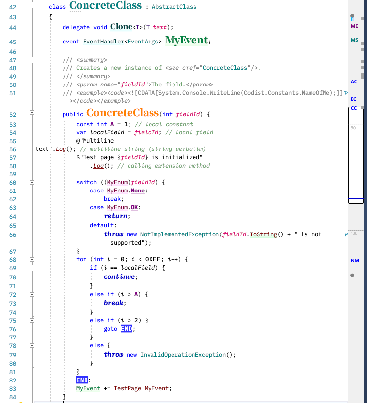
  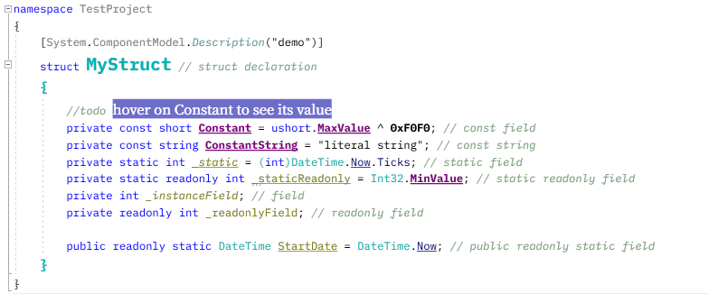

## Super Quick Info

The quick info (the tooltip shown when you hover your mouse pointer to language elements) can be enhanced by *Codist*.

* **Restricting the size** of Quick Info items. 

    Sometimes the size of Quick Info can take up a lot of space. It is possible to limit its size with *Super Quick Info*.

  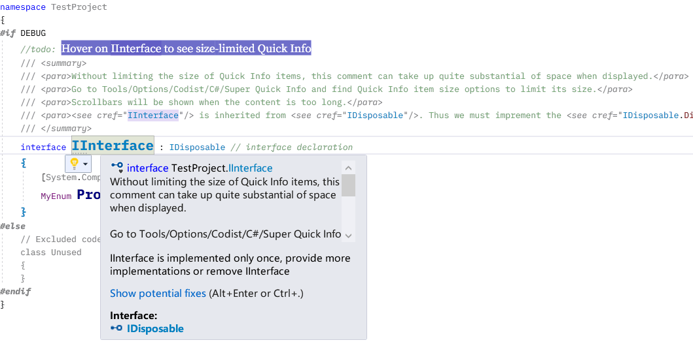

* **Click and go** of symbols

	If a symbol is defined in your source code, you can click and go to its definition.

  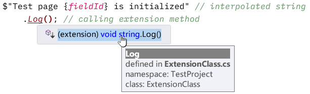

* **Numeric forms** for `Enum` values. The underlying type of `Enum` values can be shown as well.

  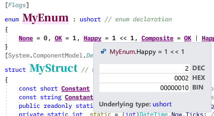

* **Numeric forms** for constants.

  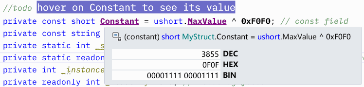

* **String length and Hash codes** for string constants. (Hint: We can use Hash codes to quickly compare whether two strings that look alike are identical)

  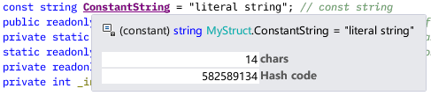

* Locations of **Extension methods**

  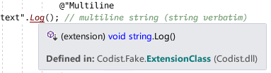

* **Attributes**

  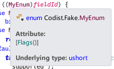

* **Base types and interfaces** of types

  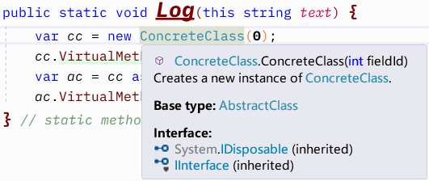

* **Method overloads**

  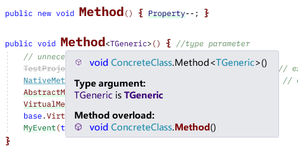

## Customized comment styles
* The comment tagger highlights comments to your specific styles.

  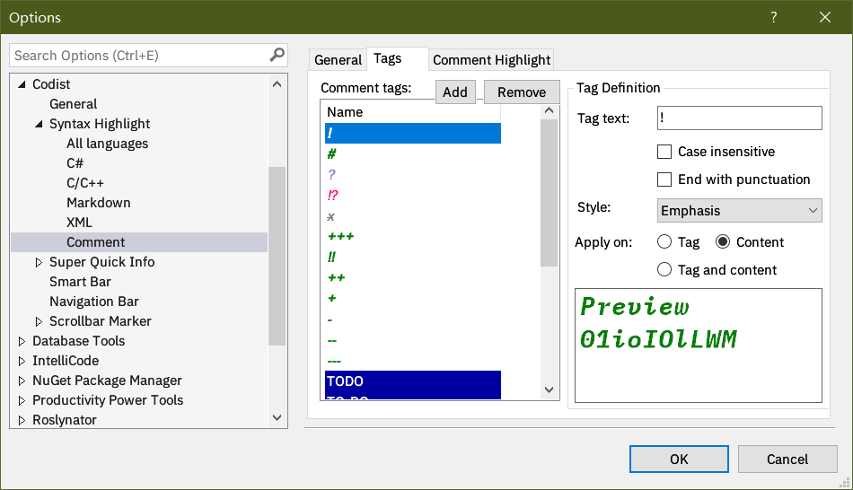

  Here's the effect of the highlighted comments.

  

* The syntax style of comments or C# XML Documentations could be changed too. You can make them semitrasparent to stand behind usual code lines by changing the *Opacity* value of the corresponding syntax parts.

## Markers on the Scrollbar Margin

The scrollbar can mark...

* C# `class`/`struct`/`interface`/`enum` **declarations** (marked with the first two capitalized characters in their names)
* C# instructions (`#if`, `#else`, `#region`, `#pragma`) (marked with a gray spot)
* **Line numbers** (marked with gray dashed lines and numbers)
* Special comments (marked with small squares)

  Please see screenshots in the above sections.

# Customization
  Open the *Codist* section in the *Tools->Options* dialog.

  
1. *Enable Codist* check box can be used to temporarily disable *Codist*.

   It is useful when your laptop are running on battery. Disabling *Codist* can help your battery sustain a little bit longer.

   *Codist* will be enabled again when you restart *Visual Studio*.

   This option works with subsequently opened new document windows. Existing document windows won't be affected.

2. You can load or save your preferred settings or load certain syntax highlight settings that come with *Codist*.

3. You can add extra margin between lines to make code text more readable.

4. In the *Misc* section you can control whether line numbers are drawn on the editor scrollbar.

   Someone who hates Quick Info can check the *Hide Quick Info until Shift is Pressed*, so Quick Info would not pop up until we pressed Shift key and hover the mouse cursor on to the code.

   *Selection info* will show you how many characters and lines are selected.

## C# options

1. Go to the *C#* options page to change C# related settings.

  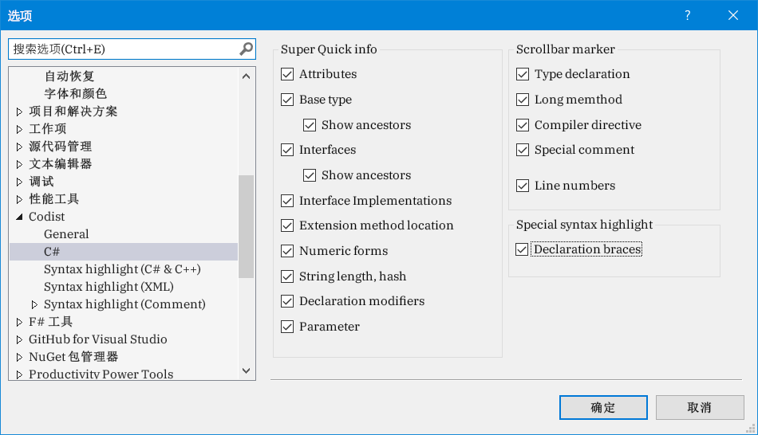
  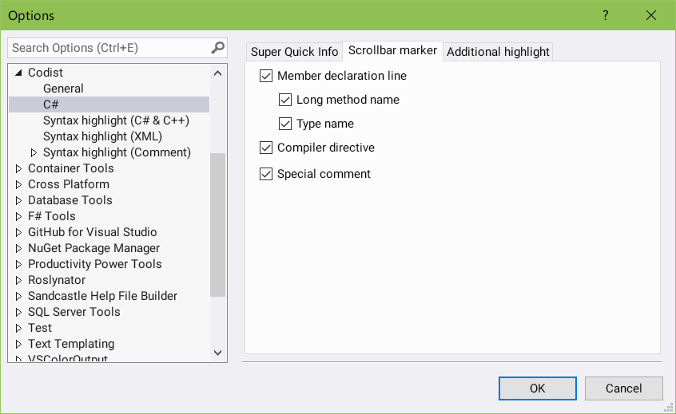
  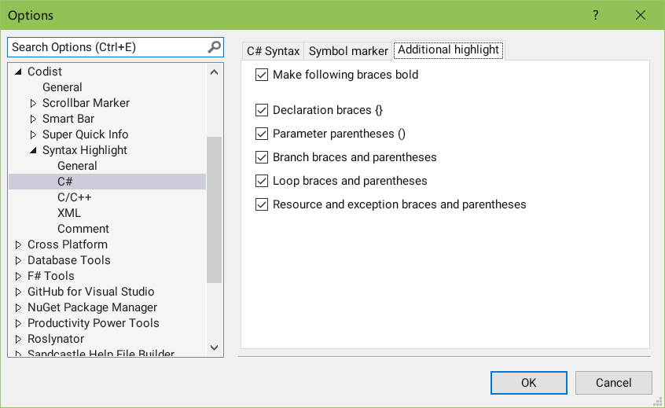

## Syntax highlight options

1. Go to the *Syntax color* options pages to change the syntax highlight settings according to your preferences.

  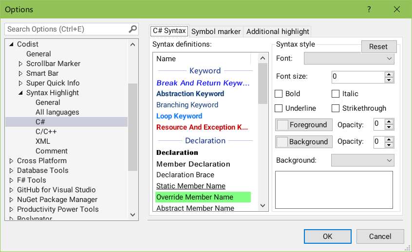

# Acknowledgements
I have learned a lot from the following extension projects.
* Visual Studio Productivity Power Tools: https://github.com/Microsoft/VS-PPT
* CoCo: https://github.com/GeorgeAlexandria/CoCo
* Better comments: https://github.com/omsharp/BetterComments
* CommentsPlus: https://github.com/mhoumann/CommentsPlus
* Inheritance Margin: https://github.com/tunnelvisionlabs/InheritanceMargin
* Font Sizer: https://github.com/Oceanware/FontSizer
* CodeBlockEndTag: https://github.com/KhaosCoders/VSCodeBlockEndTag
* Remarker: https://github.com/jgyo/remarker

# Bugs and suggestions
Please post New Issue in the GitHub project if you find any bugs or have any suggestions.
